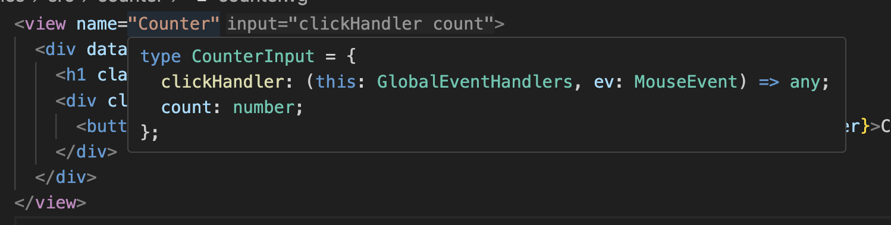

<div align="center">
  
</div>

# Introduction

VeGen is a compiler for tiny, efficient, updatable TypeScript HTML templates. A lower-level, less meaty alternative to view libraries like React.

## What Is It?

VeGen is a compiler that takes HTML templates and generates TypeScript code (with types!) that builds the HTML and allows you to efficiently update it.

Instead of DOM diffing like React, VeGen compiles templates into small, easy to understand TypeScript objects that directly track any DOM nodes that may change.

The resulting TypeScript code contains a tiny library and is dependency-free, meaning it packs down very small. The [examples app](https://vegen.dev/examples) has ~4.5 kB of compressed Javascript in total.

## Example

Here's a simple counter example:

**counter.vg:**

```xml
<view name="Counter">
  <div>
    <h1>Counter example</h1>
    <div>
      <button onclick={clickHandler}>Clicked {count | numberToString} times</button>
    </div>
  </div>
</view>
```

**main.ts:**

```typescript
import { Counter, run } from "./counter.ts";

const root = document.querySelector<HTMLDivElement>("#app")!;

root.append(
  run(Counter, (get, set) => ({
    clickHandler: () => {
      set((s) => ({ ...s, count: s.count + 1 }));
    },
    count: 0,
  }))
);
```

This generates a `Counter` function and `CounterInput` type, along with a `run` helper for managing component state.

The TypeScript generated (plus some additional comments) is:

```typescript
export type CounterInput = {
  clickHandler: (this: GlobalEventHandlers, ev: PointerEvent) => any;
  count: number;
};
export function Counter(input: CounterInput): ViewState<CounterInput> {
  // 't' is a helper for text nodes
  // 'h' is a helper for DOM nodes

  // Build the initial DOM:
  const node0 = t(numberToString(input.count));
  const node1 = h("button", { onclick: input.clickHandler }, [
    t("Clicked "),
    node0,
    t(" times"),
  ]);
  const root = h("div", {}, [
    h("h1", {}, [t("Counter example")]),
    h("div", {}, [node1]),
  ]);

  // maintain state
  let currentInput = input;

  return {
    // the root DOM element
    root,

    // the function to update the view
    update(input) {
      if (input.clickHandler !== currentInput.clickHandler) {
        node1["onclick"] = input.clickHandler;
      }
      if (input.count !== currentInput.count) {
        node0.textContent = numberToString(input.count);
      }
      currentInput = input;
    },
  };
}
```

## Who Is This For?

### Why Would You Want to Use It?

- Generates a very small amount of dependency-free TypeScript.
- Generates TypeScript types for you.
- Easy to embed into other frameworks and libraries - views are just a simple DOM `Element` and `update` function.
- Updates views efficiently (see 'Performance').
- You like to understand things end to end - easy to understand the generated output.
- You like to work at a lower level, with very little abstraction in-between you and the DOM API.

### Why Wouldn't You Want to Use It?

- VeGen is in an early development stage and lacks tools and conveniences for larger projects.
- Simpler than other tools, may be too restrictive for your needs.
- Adds another compile step, and some people hate that!
- Templates are not JavaScript, but a bespoke templating language (but it's pretty simple).

# Installation

### Cargo

```bash
cargo install vegen
```

### MacOS

```bash
brew install kmahoney/tap/vegen
```

### Linux Binary

Available on the [releases](https://github.com/KMahoney/vegen/releases) page.

# Usage

## CLI

Provide the `vegen` CLI command with `.vg` template files. Every view in every template will be compiled into TypeScript functions. Views can reference other views, including in other files.

A `.vg` template is a XML-like template that defines a series of views and can use several special forms. Each file consists of a series of `view` elements, e.g.

```xml
<view name="SimpleExample1">
    <div>view content</div>
</view>
<view name="SimpleExample2">
    <div>view content</div>
</view>
```

which will generate the TypeScript functions `Example1`, `Example2` and their corresponding input types `Example1Input`, `Example2Input`.

## VSCode Extension

An extension with syntax highlighting, language server integration, and viewable types is available on the [releases](https://github.com/KMahoney/vegen/releases) page.



# Reference

## Expressions

VeGen supports expressions within `{}` bindings, including variables, function calls, pipes, and string templates.

### Variables and Property Access

Variables can be bound using simple names or dotted property paths:

```xml
<view name="VariableExample">
  <div>
    <h1>Welcome {user.name}!</h1>
    <p>Age: {user.age}</p>
    <p>Location: {user.address.city}, {user.address.country}</p>
  </div>
</view>
```

### Function Calls

Expressions can include function calls with arguments:

```xml
<view name="FunctionCallExample">
  <div>
    <div>Count: {numberToString(count)}</div>
    <div>Price: {currency(amount, "USD")}</div>
  </div>
</view>
```

They are useful for creating closures, such as binding event handlers in for loops:

```xml
<view name="ClosureExample">
  <div>
    <for seq={items} as="item">
      <button onclick={clickItem(item.id)}>{item.name}</button>
    </for>
  </div>
</view>
```

where clickItem is `(id) => (event) => void`.

They are also useful for displaying data derived from the view inputs, but in this case you should make sure the output only changes when the inputs change, i.e. they're _referentially transparent_. Functions will be re-run when they are re-bound or their arguments change.

Built-in functions include:

- `boolean<T>(boolean, T, T) -> T`
- `numberToString(number) -> string`
- `lookup<T>(dict, key, default: T) -> T`

### Pipe Operations

Use the pipe operator `|` to chain transformations:

```xml
<view name="PipeExample">
  <div>
    <div class="display">Count: { count | numberToString }</div>
    <div>Status: { status | toUpperCase }</div>
  </div>
</view>
```

### String Templates

Create dynamic strings with interpolation:

```xml
<view name="StringTemplateExample">
  <div class="popup {boolean(visible, "show", "hide")}">
    <p>Hello!</p>
  </div>
</view>
```

## Special Forms

VeGen provides several special forms for control flow and dynamic content:

### Conditional Rendering

```xml
<if condition={showHeader}>
  <then>
    <h1>Welcome!</h1>
  </then>
  <else>
    <p>Please log in</p>
  </else>
</if>
```

This will conditionally show content and infer `showHeader` to be a `boolean`. The `<else>` block is optional.

### Loops

```xml
<ul>
  <for seq={todos} as="todo">
    <li>Title: {todo.title}</li>
  </for>
</ul>
```

This will loop through `todos`, introducing each element as the variable `todo`, and infer `todos` to be `{title: string}[]`.

### Switch

Render one of several branches based on a discriminant "type" field on a value.

```xml
<switch on={example}>
  <case name="a">
    <div>{a.foo}</div>
  </case>
  <case name="b">
    <div>{b.bar}</div>
  </case>
  <case name="c">
    <div>{c.baz | numberToString}</div>
  </case>
</switch>
```

- The `on` expression must be a discriminated union with a string literal tag in a `type` field. For example:

```ts
type Example =
  | { type: "a"; foo: string }
  | { type: "b"; bar: string }
  | { type: "c"; baz: number };
```

### Component Composition

VeGen supports composing views as reusable components within a template. Define multiple views in the same file, then use them as custom elements in parent views:

```xml
<view name="Button">
  <button onclick={onClick} class={class}>{text}</button>
</view>

<view name="UserCard">
  <div class="card">
    <h3>{user.name}</h3>
    <p>Age: {user.age | numberToString}</p>
    <Button onClick={onEdit} class="btn-primary" text="Edit" />
  </div>
</view>

<view name="UserList">
  <div class="user-list">
    <for seq={users} as="user">
      <UserCard user={user} onEdit={editHandler(user.id)} />
    </for>
  </div>
</view>
```

### Sharing Views Across Files

Use `<require src="..." />` at the top level of a template to pull in views defined in another `.vg` file. Required files are resolved relative to the current template, and all referenced views must be explicitly required. For example:

```xml
<require src="./components/header.vg" />

<view name="Page">
  <Header title={title} />
</view>
```

### Dynamically Using Components

You can also use a dynamically changing view with the 'use' form, as shown:

```xml
<use view={myView} attr={example} />
```

Where `myView` is a `View<T>` and `T` is the attribute object type.

## The `run` Helper

The generated TypeScript includes a `run` helper function that manages component state and provides reactive updates. It takes two parameters:

1. A view function (generated from your `.vg` template)
2. A builder function that receives an `update` function for state management

```ts
run(viewFunction, (update) => {
  // Return the initial input state
  return {
    // ... your state properties
    // ... event handlers that can call get() and set()
  };
});
```

The `update(currentState => newState)` function updates the state and triggers a re-render of only the changed parts of the DOM.

# Performance

VeGen generates highly efficient update code by tracking only the DOM nodes that may change in the `ViewState`. When you call the `update` function with new input, VeGen directly updates only the parts of the DOM that have actually changed.

However, to get the best performance, you need to be careful about **reusing values from the previous state** to avoid unnecessary re-renders. This is especially important with derived state.

### Avoiding Unnecessary Re-Renders

The key principle is: **if the data hasn't changed, pass the same object reference**. VeGen can then skip updating that part of the DOM entirely.

This is particularly important for:

- Arrays used in `<for>` loops
- Objects used in conditional rendering
- Any derived state created with `map`, `filter`, or similar operations

When you pass the same object reference, VeGen's update functions can quickly determine that no DOM changes are needed for that section.
