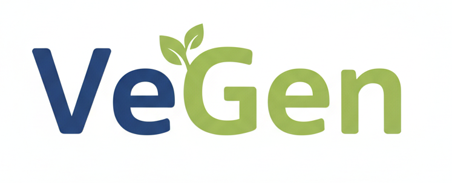

<div align="center">
  
</div>

## Introduction

VeGen is a compiler for tiny, efficient, updatable TypeScript HTML templates. A lower-level, meat-free alternative to view libraries like React.

## What Is It?

VeGen is a compiler that takes HTML templates and generates TypeScript code (with types!) that builds the HTML and allows you to efficiently update it.

Instead of DOM diffing like React, VeGen compiles templates into small, easy to understand TypeScript objects that directly track any DOM nodes that may change.

The resulting TypeScript code contains a tiny library and is dependency-free, meaning it packs down very small. The [example todo app](https://vegen.dev/todo) has 2.2 kB of compressed Javascript.

## Example

Here's a simple counter example:

**counter.vg:**

```xml
<view name="counter">
  <div>
    <h1>Counter example</h1>
    <div>
      <button onclick={clickHandler}>Clicked {count | numberToString} times</button>
    </div>
  </div>
</view>
```

**main.ts:**

```typescript
import { counter, run } from "./counter.ts";

const root = document.querySelector<HTMLDivElement>("#app")!;

root.append(
  run(counter, (get, set) => ({
    clickHandler: () => {
      const currentState = get();
      set({
        ...currentState,
        count: currentState.count + 1,
      });
    },
    count: 0,
  }))
);
```

This generates a `counter` function and `CounterInput` type, along with a `run` helper for managing component state.

The TypeScript generated (plus some additional comments) is:

```typescript
export type CounterInput = {
  clickHandler: (this: GlobalEventHandlers, ev: PointerEvent) => any;
  count: number;
};
export function counter(input: CounterInput): ViewState<CounterInput> {
  // 't' is a helper for text nodes
  // 'h' is a helper for DOM nodes

  // Build the initial DOM:
  const node0 = t(numberToString(input.count));
  const node1 = h("button", { onclick: input.clickHandler }, [
    t("Clicked "),
    node0,
    t(" times"),
  ]);
  const root = h("div", {}, [
    h("h1", {}, [t("Counter example")]),
    h("div", {}, [node1]),
  ]);

  // maintain state
  let currentInput = input;

  return {
    // the root DOM element
    root,

    // the function to update the view
    update(input) {
      if (input.clickHandler !== currentInput.clickHandler) {
        node1["onclick"] = input.clickHandler;
      }
      if (input.count !== currentInput.count) {
        node0.textContent = numberToString(input.count);
      }
      currentInput = input;
    },
  };
}
```

## Installation

```bash
cargo install vegen
```

## Why Would You Want to Use It?

- Generates a very small amount of dependency-free TypeScript.
- Generates TypeScript types for you.
- Easy to embed into other frameworks and libraries - views are just a simple DOM `Element` and `update` function.
- Updates views efficiently (see 'Performance').
- You like to understand things end to end - easy to understand the generated output.
- You like to work at a lower level, with very little abstraction in-between you and the DOM API.

## Why Wouldn't You Want to Use It?

- VeGen is in an early development stage and lacks tools and conveniences for larger projects.
- Simpler than other tools, may be too restrictive for your needs.
- Adds another compile step, and some people hate that!
- Templates are not JavaScript, but a bespoke templating language (but it's pretty simple).

## Performance

VeGen generates highly efficient update code by tracking only the DOM nodes that may change in the `ViewState`. When you call the `update` function with new input, VeGen directly updates only the parts of the DOM that have actually changed.

However, to get the best performance, you need to be careful about **reusing values from the previous state** to avoid unnecessary re-renders. This is especially important with derived state.

### Avoiding Unnecessary Re-Renders

The key principle is: **if the data hasn't changed, pass the same object reference**. VeGen can then skip updating that part of the DOM entirely.

This is particularly important for:

- Arrays used in `<for>` loops
- Objects used in conditional rendering
- Any derived state created with `map`, `filter`, or similar operations

When you pass the same object reference, VeGen's update functions can quickly determine that no DOM changes are needed for that section.

## Usage

Provide the `vegen` CLI command with `.vg` template files. Every view in every template will be compiled into TypeScript functions. Views can reference other views, including in other files.

A `.vg` template is a XML-like template that defines a series of views and can use several special forms. Each file consists of a series of `view` elements, e.g.

```xml
<view name="example1">
    view content
</view>
<view name="example2">
    view content
</view>
```

which will generate the TypeScript functions `example1`, `example2` and their corresponding input types `Example1Input`, `Example2Input`.

### Expressions

VeGen supports expressions within `{}` bindings, including variables, function calls, pipes, and string templates.

#### Variables and Property Access

Variables can be bound using simple names or dotted property paths:

```xml
<view name="userProfile">
  <h1>Welcome {user.name}!</h1>
  <p>Age: {user.age}</p>
  <p>Location: {user.address.city}, {user.address.country}</p>
</view>
```

#### Function Calls

Expressions can include function calls with arguments:

```xml
<view name="formatted">
  <div>Count: {formatNumber(count)}</div>
  <div>Price: {currency(amount, "USD")}</div>
</view>
```

built in functions include `boolean<T>(boolean, T, T) -> T` and `numberToString(number) -> string`.

#### Pipe Operations

Use the pipe operator `|` to chain transformations:

```xml
<view name="counter">
  <div className="display">Count: {count | numberToString}</div>
  <div>Status: {status | toUpperCase | prepend("Current: ")}</div>
</view>
```

#### String Templates

Create dynamic strings with interpolation:

```xml
<view name="greeting">
  <p>{greeting}, {user.firstName} {user.lastName}!</p>
  <p>Score: {"{points} / {total} ({percentage | formatPercent})"}</p>
</view>
```

#### Complex Expressions

Expressions can be nested and combined:

```xml
<view name="advanced">
  <div>{user.name | formatName("{first} {last}") | toUpperCase}</div>
  <button onclick={handleClick(user.id, "edit")}>Edit {user.name}</button>
</view>
```

All expressions are statically typed and will infer appropriate TypeScript types for your input objects.

### Special Forms

VeGen provides several special forms for control flow and dynamic content:

#### Conditional Rendering

```xml
<if condition={showHeader}>
  <then>
    <h1>Welcome!</h1>
  </then>
  <else>
    <p>Please log in</p>
  </else>
</if>
```

This will conditionally show content and infer `showHeader` to be a `boolean`. The `<else>` block is optional.

#### Loops

```xml
<ul>
  <for seq={todos} as="todo">
    <li>Title: {todo.title}</li>
  </for>
</ul>
```

This will loop through `todos`, introducing each element as the variable `todo`, and infer `todos` to be `{title: string}[]`.

#### Switch

Render one of several branches based on a discriminant "type" field on a value.

```xml
<switch on={example}>
  <case name="a">
    <div>{a.foo}</div>
  </case>
  <case name="b">
    <div>{b.bar}</div>
  </case>
  <case name="c">
    <div>{c.baz | numberToString}</div>
  </case>
</switch>
```

- The `on` expression must be a discriminated union with a string literal tag in a `type` field. For example:

```ts
type Example =
  | { type: "a"; foo: string }
  | { type: "b"; bar: string }
  | { type: "c"; baz: number };
```

#### Mounting Components

```xml
<mount use={myComponent} />
```

Where `myComponent` is a function `() => Element` that is mounted into the view.

In combination with the `run` helper, this can be used for rudimentary components with their own internal state.

#### Using Other Views

```xml
<use view="counter" input={counter0} />
```

Mounts another view with the specified input.

### The `run` Helper

The generated TypeScript includes a `run` helper function that manages component state and provides reactive updates. It takes two parameters:

1. A view function (generated from your `.vg` template)
2. A builder function that receives `get` and `set` functions for state management

```ts
run(viewFunction, (get, set) => {
  // Return the initial input state
  return {
    // ... your state properties
    // ... event handlers that can call get() and set()
  };
});
```

The `get()` function returns the current state, and `set()` updates the state and triggers a re-render of only the changed parts of the DOM.
